# Admin API - Component Diagram

This diagram shows the internal components within the Admin API container and their interactions.

## Admin API - Component Level

```mermaid
C4Component
    title Component Diagram - Admin API Application

    Person(platformAdmin, "Platform Admin")
    Person(supportStaff, "Support Staff")

    Container_Boundary(adminAPI, "Admin API Application") {
        Component(authUsersCtrl, "Auth Users Controller", "Express Router", "Search auth users by logtoUserId or email")
        Component(lawFirmsCtrl, "Law Firms Controller", "Express Router", "Law firm CRUD operations")
        Component(usersCtrl, "Users Controller", "Express Router", "Generic user provisioning endpoints")
        Component(credentialsCtrl, "Credentials Controller", "Express Router", "Professional credentials management")
        Component(profilesCtrl, "Profiles Controller", "Express Router", "List/filter user profiles")
        Component(orgsCtrl, "Organizations Controller", "Express Router", "Logto org management")
        Component(membersCtrl, "Members Controller", "Express Router", "Org member management")
        Component(rolesCtrl, "Roles Controller", "Express Router", "Org role management")
        Component(accessGrantsCtrl, "Access Grants Controller", "Express Router", "Resource access grants")
        Component(supportAccessCtrl, "Support Access Controller", "Express Router", "Act-as session management")

        Component(lawFirmSvc, "Law Firm Service", "Business Logic", "Firm creation, Logto org linking")
        Component(userProvSvc, "User Provisioning Service", "Business Logic", "Multi-step generic user provisioning")
        Component(credentialSvc, "Credential Service", "Business Logic", "Credential validation, CRUD")
        Component(logtoSvc, "Logto Integration Service", "Business Logic", "Wraps Logto SDK, handles sync")
        Component(accessGrantSvc, "Access Grant Service", "Business Logic", "Grant validation, policy computation")
        Component(supportAccessSvc, "Support Access Service", "Business Logic", "Session creation, token delegation")
        Component(capabilitySvc, "Capability Aggregation Service", "Business Logic", "Aggregates scopes, policies, cases")

        Component(authMiddleware, "Auth Middleware", "Express Middleware", "JWT validation, admin check")
        Component(validationMW, "Validation Middleware", "Express Middleware", "Request schema validation")

        Component(lawFirmRepo, "Law Firm Repository", "Data Access", "LAW_FIRMS table")
        Component(authUserRepo, "Auth User Repository", "Data Access", "AUTH_USERS table")
        Component(profileRepo, "Profile Repository", "Data Access", "FIRM_USER_PROFILES table")
        Component(credentialRepo, "Credential Repository", "Data Access", "PROFESSIONAL_CREDENTIALS table")
        Component(grantRepo, "Grant Repository", "Data Access", "RESOURCE_ACCESS_GRANTS table")
        Component(orgMirrorRepo, "Org Mirror Repository", "Data Access", "LOGTO_ORGS_MIRROR, MEMBERS_MIRROR")
        Component(sessionRepo, "Session Repository", "Data Access", "SUPPORT_ACCESS_SESSIONS table")
    }

    ContainerDb(db, "PostgreSQL", "Application data store")
    System_Ext(logtoAPI, "Logto Management API", "Identity platform")
    Container(lawFirmApp, "Law Firm App", "Main application")

    Rel(platformAdmin, lawFirmsCtrl, "Creates firms", "HTTPS")
    Rel(platformAdmin, usersCtrl, "Provisions users", "HTTPS")
    Rel(platformAdmin, credentialsCtrl, "Manages credentials", "HTTPS")
    Rel(platformAdmin, profilesCtrl, "Lists/filters profiles", "HTTPS")
    Rel(platformAdmin, membersCtrl, "Manages members", "HTTPS")
    Rel(supportStaff, supportAccessCtrl, "Starts sessions", "HTTPS")

    Rel(lawFirmsCtrl, authMiddleware, "Uses")
    Rel(usersCtrl, authMiddleware, "Uses")
    Rel(credentialsCtrl, authMiddleware, "Uses")
    Rel(profilesCtrl, authMiddleware, "Uses")
    Rel(membersCtrl, authMiddleware, "Uses")
    Rel(supportAccessCtrl, authMiddleware, "Uses")

    Rel(authMiddleware, logtoAPI, "Verifies tokens")

    Rel(lawFirmsCtrl, lawFirmSvc, "Calls")
    Rel(usersCtrl, userProvSvc, "Calls")
    Rel(credentialsCtrl, credentialSvc, "Calls")
    Rel(profilesCtrl, profileRepo, "Queries directly")
    Rel(profilesCtrl, credentialRepo, "Joins for filtering")
    Rel(orgsCtrl, logtoSvc, "Calls")
    Rel(membersCtrl, logtoSvc, "Calls")
    Rel(rolesCtrl, logtoSvc, "Calls")
    Rel(accessGrantsCtrl, accessGrantSvc, "Calls")
    Rel(supportAccessCtrl, supportAccessSvc, "Calls")

    Rel(lawFirmSvc, lawFirmRepo, "Uses")
    Rel(lawFirmSvc, logtoSvc, "Creates Logto org")

    Rel(userProvSvc, authUserRepo, "Creates auth user")
    Rel(userProvSvc, profileRepo, "Creates profile with roles")
    Rel(userProvSvc, credentialSvc, "Creates credentials")
    Rel(userProvSvc, logtoSvc, "Invites to org")

    Rel(credentialSvc, credentialRepo, "CRUD operations")

    Rel(logtoSvc, logtoAPI, "Makes API calls", "HTTPS")
    Rel(logtoSvc, orgMirrorRepo, "Syncs local cache")

    Rel(accessGrantSvc, grantRepo, "Manages grants")
    Rel(capabilitySvc, grantRepo, "Reads grants")
    Rel(capabilitySvc, profileRepo, "Reads profiles")

    Rel(supportAccessSvc, sessionRepo, "Manages sessions")
    Rel(supportAccessSvc, authUserRepo, "Resolves target user")
    Rel(supportAccessSvc, lawFirmApp, "Returns token for")

    Rel(lawFirmRepo, db, "SQL")
    Rel(authUserRepo, db, "SQL")
    Rel(profileRepo, db, "SQL")
    Rel(credentialRepo, db, "SQL")
    Rel(grantRepo, db, "SQL")
    Rel(orgMirrorRepo, db, "SQL")
    Rel(sessionRepo, db, "SQL")

    UpdateLayoutConfig($c4ShapeInRow="4", $c4BoundaryInRow="1")
```

## Component Descriptions

### Controllers (API Endpoints)

#### Auth Users Controller
- `GET /admin/auth-users` - Search by logtoUserId or email

#### Law Firms Controller
- `POST /admin/law-firms` - Create new law firm with optional Logto org
- `GET /admin/law-firms` - List all law firms
- `GET /admin/law-firms/{lawFirmId}` - Get specific law firm

#### Users Controller (v1.3.0 - Generic Provisioning)
- `POST /admin/law-firms/{lawFirmId}/users` - Provision any user (identity + profile + roles + optional credentials)

#### Credentials Controller (v1.3.0)
- `GET /admin/law-firms/{lawFirmId}/users/{userId}/credentials` - List professional credentials
- `POST /admin/law-firms/{lawFirmId}/users/{userId}/credentials` - Add credential (BAR_LICENSE, NOTARY, OTHER)
- `DELETE /admin/law-firms/{lawFirmId}/users/{userId}/credentials/{credentialId}` - Remove credential

#### Profiles Controller (v1.3.0)
- `GET /admin/law-firms/{lawFirmId}/profiles` - List/filter user profiles by role, credential type, jurisdiction, etc.

#### Organizations Controller
- `GET /admin/logto-orgs` - List Logto organizations
- `POST /admin/law-firms/{lawFirmId}/logto-org/sync` - Sync Logto org to local cache

#### Members Controller
- `GET /admin/law-firms/{lawFirmId}/members` - List org members (from local cache)
- `POST /admin/law-firms/{lawFirmId}/members` - Add/invite member to Logto org
- `GET /admin/law-firms/{lawFirmId}/members/{memberId}` - Get specific member
- `DELETE /admin/law-firms/{lawFirmId}/members/{memberId}` - Remove member from org
- `PUT /admin/law-firms/{lawFirmId}/members/{memberId}/org-roles` - Update member roles

#### Roles Controller
- `GET /admin/logto-org-roles` - List available Logto org roles

#### Access Grants Controller
- `GET /admin/resource-types` - List allowed resource types
- `GET /admin/resource-types/{type}/subresource-types` - List subresource types
- `GET /admin/resource-access-grants` - Search grants
- `GET /admin/resources/{type}/{id}/grants` - List grants for resource
- `POST /admin/resources/{type}/{id}/grants` - Create grant
- `DELETE /admin/resources/{type}/{id}/grants/{grantId}` - Revoke grant
- Similar endpoints for subresources

#### Support Access Controller (v1.3.0)
- `POST /admin/support-access/requests` - Start act-as session
- `GET /admin/support-access/sessions` - List active sessions
- `GET /admin/support-access/sessions/{id}` - Get session details
- `DELETE /admin/support-access/sessions/{id}` - Revoke session

### Services (Business Logic)

#### Law Firm Service
- Creates law firm tenant records
- Optionally creates corresponding Logto organization
- Links law firm to Logto org ID
- Validates firm data

#### User Provisioning Service (v1.3.0 - Replaces Lawyer Provisioning)
- **Multi-step generic provisioning flow**:
  1. Create or link Logto user account (identity)
  2. Create AUTH_USERS record
  3. Create FIRM_USER_PROFILES record with functional roles array
  4. Optionally create PROFESSIONAL_CREDENTIALS records
  5. Invite user to firm's Logto organization with specified org roles
- **Functional roles**: LAWYER, PARALEGAL, RECEPTIONIST, BILLING_ADMIN, IT_ADMIN, INTERN, OTHER
- Handles transactional rollback on failure
- Sends invitation emails via Logto

#### Credential Service (v1.3.0)
- Validates credential types (BAR_LICENSE, NOTARY, OTHER)
- CRUD operations on professional credentials
- Validates jurisdiction codes
- Links credentials to users

#### Logto Integration Service
- Wraps Logto Management API SDK
- Organization management (create, list, get)
- Member management (add, remove, list)
- Org role management (assign, update, list)
- **Sync operations**: Pulls Logto data to local mirrors
- Handles Logto API errors and retries

#### Access Grant Service
- Validates resource and subresource types
- Creates manual access grants
- Revokes grants
- Computes effective field policies for users
- Respects resource hierarchies

#### Support Access Service (v1.3.0)
- Creates time-limited support access sessions
- Generates delegated JWT tokens for target users
- Records session metadata (admin, target, timestamp, expiry)
- Lists and retrieves active sessions
- Revokes sessions before expiry

#### Capability Aggregation Service (v1.2.0)
- Aggregates user capabilities from multiple sources:
  - **Scopes**: From Logto org roles
  - **Field policies**: From resource grants
  - **Case ID sets**: From case assignments
- Provides unified view of user permissions

### Repositories (Data Access)

#### Law Firm Repository
- CRUD operations on LAW_FIRMS table
- Queries by Logto org ID

#### Auth User Repository
- CRUD operations on AUTH_USERS table
- Search by logtoUserId or email
- Links to Logto user accounts

#### Profile Repository
- CRUD operations on FIRM_USER_PROFILES table
- Manages user profiles within firms with functional roles array
- Supports filtering by role, credential type, jurisdiction, active status
- Joins with PROFESSIONAL_CREDENTIALS for advanced filtering

#### Credential Repository (v1.3.0 - Replaces License Repository)
- CRUD operations on PROFESSIONAL_CREDENTIALS table
- Stores professional credentials (bar licenses, notary, etc.)
- Supports filtering by type and jurisdiction
- Links to users via userId foreign key

#### Grant Repository
- CRUD operations on RESOURCE_ACCESS_GRANTS table
- Queries by user, resource type, resource ID
- Supports hierarchical resource queries

#### Org Mirror Repository
- Manages LOGTO_ORGS_MIRROR table
- Manages LOGTO_ORG_MEMBERS_MIRROR table
- Syncs data from Logto
- Provides local cache for faster queries

#### Session Repository (v1.3.0)
- Manages SUPPORT_ACCESS_SESSIONS table
- CRUD operations on support sessions
- Queries active sessions
- Filters by admin or target user

## Design Patterns

### Repository Pattern
All data access abstracted through repository layer for testability and maintainability.

### Service Layer
Business logic separated from controllers, enabling reuse and independent testing.

### Middleware Chain
Cross-cutting concerns (auth, validation) handled via Express middleware.

### Sync & Cache
Logto data synced to local mirrors for performance and offline queries.

### Multi-Step Provisioning
User provisioning uses transactional pattern across multiple tables and external API calls, supporting any staff type via functional roles.

### Role-Driven Model (v1.3.0)
- Replaced boolean `isLawyer` with `roles` array on FirmUserProfile
- Functional roles: LAWYER, PARALEGAL, RECEPTIONIST, BILLING_ADMIN, IT_ADMIN, INTERN, OTHER
- Allows users to have multiple roles
- Professional credentials stored separately and linked to users

### Credential Management (v1.3.0)
- Professional credentials (BAR_LICENSE, NOTARY, OTHER) replace lawyer-specific licenses
- Credentials are separate entities linked to users
- Supports multiple credentials per user
- Enables filtering users by credential type and jurisdiction

### Delegated Authentication
Support access returns JWT tokens that allow impersonation in downstream systems.

## Error Handling

- Logto API failures trigger retries with exponential backoff
- Provisioning failures rollback database transactions
- Invalid grants return 400 with detailed error messages
- Unauthorized requests return 401 with WWW-Authenticate header
- Not found resources return 404
