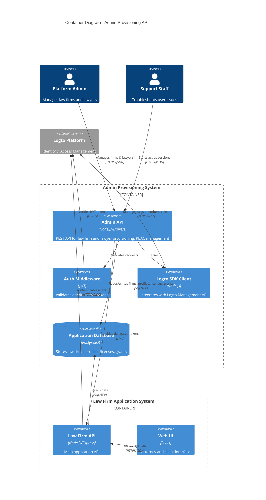

# Admin API - Container Diagram

This diagram shows the high-level containers and how they interact within the Admin Provisioning system.

## Admin Provisioning System - Container Level

## Container Descriptions

### Admin API
- **Technology**: Node.js with Express framework
- **Purpose**: Central API for administrative operations
- **Responsibilities**:
  - Law firm CRUD operations
  - Lawyer provisioning (auth users + profiles + licenses)
  - RBAC management via Logto
  - Resource access grant management
  - Support access session management
  - User search and capability aggregation

### Auth Middleware
- **Technology**: JWT validation middleware
- **Purpose**: Secures admin endpoints
- **Responsibilities**:
  - Validates bearer tokens from requests
  - Verifies tokens with Logto
  - Enforces admin-level permissions
  - Extracts admin user context

### Logto SDK Client
- **Technology**: Logto Management API SDK for Node.js
- **Purpose**: Integration layer with Logto platform
- **Responsibilities**:
  - Organization management (create, list, sync)
  - Member management (add, remove, invite)
  - Org role assignment and updates
  - List available org roles
  - Sync organization data locally

### Application Database
- **Technology**: PostgreSQL
- **Schema Tables**:
  - `LAW_FIRMS`: Firm metadata, Logto org ID mapping
  - `AUTH_USERS`: User accounts synced with Logto
  - `FIRM_USER_PROFILES`: User profiles within firms, with functional roles array
  - `PROFESSIONAL_CREDENTIALS`: Professional credentials (bar licenses, notary, etc.) - replaces LAWYER_LICENSES
  - `RESOURCE_ACCESS_GRANTS`: Fine-grained access control
  - `LOGTO_ORGS_MIRROR`: Local cache of Logto organizations
  - `LOGTO_ORG_MEMBERS_MIRROR`: Local cache of org memberships
  - `SUPPORT_ACCESS_SESSIONS`: Active act-as sessions

## Integration Patterns

### Dual RBAC Model
1. **Logto-managed**: Organizations, members, and org roles
2. **App-managed**: Optional fine-grained resource access grants

### Sync Strategy
- Admin API syncs Logto organizations and memberships to local mirrors
- Local mirrors provide faster queries and offline resilience
- Sync triggered on-demand via API endpoint

### Support Access Flow
1. Support staff calls `POST /admin/support-access/requests`
2. Admin API creates session record with expiration
3. Returns short-lived delegated JWT token
4. Token allows support staff to act as target user
5. Session can be revoked via `DELETE /admin/support-access/sessions/{id}`

## API Version History

### v1.0.0
- Basic law firm and lawyer provisioning
- Logto organization management
- Resource access grants

### v1.2.0
- Added `GET /admin/auth-users` for user search
- Added `GET /admin/law-firms/{lawFirmId}/users/{userId}/resource-policies`
- Added `GET /admin/law-firms/{lawFirmId}/users/{userId}/capabilities`

### v1.3.0 (Current)
- **Generic User Provisioning (Role/Credential-Driven)**:
  - `POST /admin/law-firms/{lawFirmId}/users` - Generic user provisioning
  - `POST /admin/law-firms/{lawFirmId}/users/{userId}/credentials` - Add credential
  - `GET /admin/law-firms/{lawFirmId}/users/{userId}/credentials` - List credentials
  - `DELETE /admin/law-firms/{lawFirmId}/users/{userId}/credentials/{credentialId}` - Remove credential
  - `GET /admin/law-firms/{lawFirmId}/profiles` - List profiles (filterable by role/credential)
- **Support Access (Act-As)**:
  - `POST /admin/support-access/requests`
  - `GET /admin/support-access/sessions`
  - `GET /admin/support-access/sessions/{id}`
  - `DELETE /admin/support-access/sessions/{id}`
