# Component Diagram

This diagram shows the components within the API Application container.

## API Application - Component Level

```mermaid
C4Component
    title Component diagram for API Application

    Container(web, "Web Application", "React", "Provides UI for attorneys")
    Container(mobile, "Mobile App", "React Native", "Provides UI for clients")

    Container_Boundary(api, "API Application") {
        Component(authCtrl, "Authentication Controller", "Express Router", "Handles user authentication and token generation")
        Component(caseCtrl, "Case Controller", "Express Router", "Handles case CRUD operations")
        Component(clientCtrl, "Client Controller", "Express Router", "Handles client CRUD operations")
        Component(docCtrl, "Document Controller", "Express Router", "Handles document operations")

        Component(authSvc, "Authentication Service", "Node.js", "Validates credentials, manages sessions")
        Component(caseSvc, "Case Service", "Node.js", "Business logic for case management")
        Component(clientSvc, "Client Service", "Node.js", "Business logic for client management")
        Component(docSvc, "Document Service", "Node.js", "Business logic for document management")

        Component(authMw, "Auth Middleware", "Express Middleware", "Validates JWT tokens, enforces permissions")
        Component(validMw, "Validation Middleware", "Express Middleware", "Validates request schemas")
        Component(errorMw, "Error Handler", "Express Middleware", "Centralizes error handling")

        Component(caseRepo, "Case Repository", "Node.js", "Data access for cases")
        Component(clientRepo, "Client Repository", "Node.js", "Data access for clients")
        Component(docRepo, "Document Repository", "Node.js", "Data access for documents")
        Component(userRepo, "User Repository", "Node.js", "Data access for users")
    }

    ContainerDb(db, "Database", "PostgreSQL", "Stores all data")
    ContainerQueue(queue, "Message Queue", "RabbitMQ", "Async tasks")
    System_Ext(storage, "Cloud Storage", "AWS S3", "File storage")

    Rel(web, authCtrl, "Uses", "JSON/HTTPS")
    Rel(web, caseCtrl, "Uses", "JSON/HTTPS")
    Rel(web, clientCtrl, "Uses", "JSON/HTTPS")
    Rel(web, docCtrl, "Uses", "JSON/HTTPS")
    Rel(mobile, authCtrl, "Uses", "JSON/HTTPS")
    Rel(mobile, caseCtrl, "Uses", "JSON/HTTPS")

    Rel(authCtrl, validMw, "Uses")
    Rel(caseCtrl, authMw, "Uses")
    Rel(caseCtrl, validMw, "Uses")
    Rel(clientCtrl, authMw, "Uses")
    Rel(clientCtrl, validMw, "Uses")
    Rel(docCtrl, authMw, "Uses")
    Rel(docCtrl, validMw, "Uses")

    Rel(authCtrl, authSvc, "Uses")
    Rel(caseCtrl, caseSvc, "Uses")
    Rel(clientCtrl, clientSvc, "Uses")
    Rel(docCtrl, docSvc, "Uses")

    Rel(authSvc, userRepo, "Uses")
    Rel(caseSvc, caseRepo, "Uses")
    Rel(clientSvc, clientRepo, "Uses")
    Rel(docSvc, docRepo, "Uses")

    Rel(caseRepo, db, "Reads/writes", "SQL")
    Rel(clientRepo, db, "Reads/writes", "SQL")
    Rel(docRepo, db, "Reads/writes", "SQL")
    Rel(userRepo, db, "Reads/writes", "SQL")

    Rel(docSvc, queue, "Publishes to", "AMQP")
    Rel(docSvc, storage, "Uploads to", "HTTPS")

    UpdateLayoutConfig($c4ShapeInRow="4", $c4BoundaryInRow="1")
```

## Component Descriptions

### Controllers
- **Authentication Controller**: Handles login, logout, token refresh
- **Case Controller**: RESTful endpoints for case operations
- **Client Controller**: RESTful endpoints for client operations
- **Document Controller**: RESTful endpoints for document operations

### Services
- **Authentication Service**: JWT generation, password hashing, session management
- **Case Service**: Case validation, status transitions, assignment logic
- **Client Service**: Client onboarding, validation, conflict checking
- **Document Service**: File validation, metadata extraction, version control

### Middleware
- **Auth Middleware**: JWT validation, permission checks, role-based access control
- **Validation Middleware**: Request schema validation using Joi
- **Error Handler**: Consistent error responses, logging, error tracking

### Repositories
- **Case Repository**: Database queries for cases
- **Client Repository**: Database queries for clients
- **Document Repository**: Database queries for document metadata
- **User Repository**: Database queries for users and authentication

## Design Patterns

- **Layered Architecture**: Controllers -> Services -> Repositories
- **Dependency Injection**: Services injected into controllers
- **Repository Pattern**: Data access abstraction
- **Middleware Chain**: Cross-cutting concerns (auth, validation, errors)
