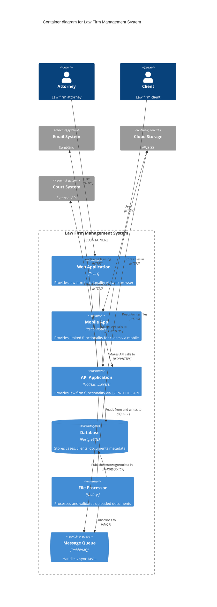

# Container Diagram

This diagram shows the high-level technology choices and how containers communicate with each other.

## Law Firm System - Container Level

## Container Descriptions

### Web Application
- **Technology**: React with TypeScript
- **Purpose**: Full-featured interface for attorneys and administrators
- **Responsibilities**: Case management, client management, document handling

### Mobile App
- **Technology**: React Native
- **Purpose**: Client portal for viewing case status
- **Responsibilities**: Limited read-only access for clients

### API Application
- **Technology**: Node.js with Express
- **Purpose**: Central business logic and data access layer
- **Responsibilities**: Authentication, authorization, business rules, data validation

### Database
- **Technology**: PostgreSQL
- **Purpose**: Persistent data storage
- **Stores**: Cases, clients, users, document metadata, audit logs

### File Processor
- **Technology**: Node.js worker service
- **Purpose**: Asynchronous document processing
- **Responsibilities**: Virus scanning, OCR, metadata extraction, thumbnails

### Message Queue
- **Technology**: RabbitMQ
- **Purpose**: Asynchronous task processing
- **Use cases**: Document processing, email notifications, report generation
