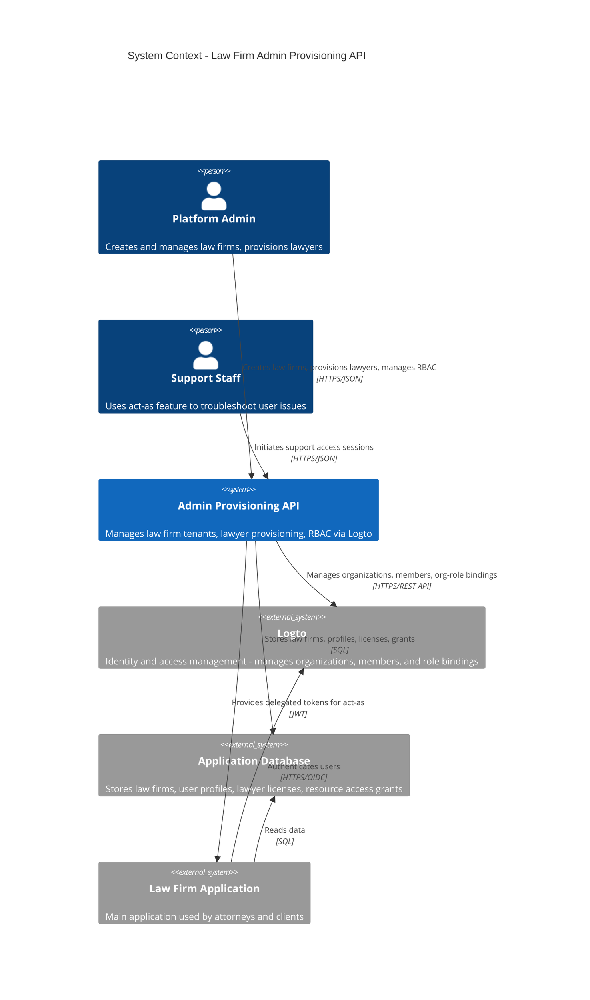

# Admin API - System Context Diagram

This diagram shows the system context for the Law Firm Admin Provisioning API and how it interacts with users and external systems.

## Admin Provisioning API - System Context

## Key Actors

### Platform Admin
- Creates new law firm tenants with optional Logto organization
- Provisions lawyers with auth users, profiles, and optional licenses
- Manages RBAC by assigning org roles to firm members
- Manages fine-grained resource access grants
- Views effective user permissions and capabilities

### Support Staff
- Initiates support access sessions (act-as) to impersonate users
- Receives short-lived delegated tokens to troubleshoot issues
- Can list, view, and revoke active support sessions

## External Systems

### Logto (Identity Provider)
- **Organizations**: Represents law firm tenants in the identity system
- **Members**: Users who belong to organizations
- **Org Roles**: Role assignments within organizations (e.g., admin, attorney, paralegal)
- Provides OIDC/OAuth2 authentication for the main application

### Application Database
- Stores law firm metadata (name, settings, Logto org ID mapping)
- Manages user profiles (AUTH_USERS, FIRM_USER_PROFILES with functional roles)
- Tracks professional credentials (PROFESSIONAL_CREDENTIALS replaces LAWYER_LICENSES)
- Maintains optional resource access grants for fine-grained permissions

### Law Firm Application
- Main application where attorneys manage cases and clients
- Consumes JWT tokens from Logto for authentication
- Honors RBAC roles and resource grants from admin API

## Key Features (v1.3.0)

### Law Firm Management
- Create law firms with automatic Logto organization creation
- List and retrieve law firm details
- Map law firms to Logto organizations

### Generic User Provisioning (Role/Credential-Driven)
- Create Logto user accounts (identity)
- Create firm user profiles with functional roles
- Assign professional credentials (BAR_LICENSE, NOTARY, OTHER)
- Invite to Logto organization with specified roles
- **Functional roles**: LAWYER, PARALEGAL, RECEPTIONIST, BILLING_ADMIN, IT_ADMIN, INTERN, OTHER

### Professional Credentials Management
- Add credentials to users (bar licenses, notary, etc.)
- List user credentials
- Remove credentials
- Filter users by credential type and jurisdiction

### RBAC Management (Logto-managed)
- Sync Logto organizations and memberships locally
- Add/invite members to organizations
- Assign and update org roles for members
- Remove members from organizations
- List available org roles

### Resource Access Management
- List allowed resource and subresource types
- Search and manage access grants
- Create and revoke manual access grants at root and subresource levels
- View effective resource field policies for users
- Aggregate user capabilities (scopes + policies + case sets)

### Support Access (Act-As)
- Start support access sessions with target user impersonation
- Receive short-lived delegated tokens
- List and retrieve active sessions
- Revoke support access sessions

## Security Model

The Admin API uses **Logto-managed RBAC** where:
- Organizations in Logto represent law firm tenants
- Org roles define permissions within each tenant
- The application maintains optional fine-grained access grants
- Support access provides time-limited user impersonation for troubleshooting
