# Backstage API Architecture (C4 Model)

Complete C4 architecture documentation for the Law Firm **Backstage API System**, which encompasses both **Admin API** (provisioning & management) and **User API** (lawyer/staff portal).

## 🎯 Overview

The **Backstage API** is the unified backend system that powers the law firm's internal operations. It consists of two major API surfaces:

- **Admin API**: Administrative operations, provisioning, access control, and system management
- **User API**: Day-to-day operations for lawyers, paralegals, and staff (cases, clients, documents, time tracking, etc.)

Both APIs share:
- Authentication infrastructure (Logto)
- Database layer (PostgreSQL + Redis)
- Common security model (RBAC + field-level permissions)
- Unified audit logging
- Shared infrastructure and deployment

---

## Level 1: System Context

### Backstage System in the Larger Ecosystem

```mermaid
graph TB
    %% Users
    Admin[("👤 Admin User<br/>(System Admin)")]
    Lawyer[("👤 Lawyer<br/>(Attorney)")]
    Paralegal[("👤 Paralegal<br/>(Legal Assistant)")]
    Staff[("👤 Staff<br/>(Billing, Records)")]
    Client[("👤 Client<br/>(External)")]

    %% Core System
    subgraph Backstage["🏢 Backstage API System"]
        AdminAPI["Admin API<br/>(Provisioning)"]
        UserAPI["User API<br/>(Portal)"]
    end

    %% Frontend Apps
    WebApp["💻 Web Application<br/>(React)"]
    MobileApp["📱 Mobile App<br/>(React Native)"]
    AdminPortal["🛠️ Admin Portal<br/>(React)"]

    %% External Systems
    Logto["🔐 Logto<br/>(Identity Provider)"]
    S3["☁️ AWS S3<br/>(Document Storage)"]
    Email["📧 SendGrid<br/>(Email Service)"]
    SMS["📱 Twilio<br/>(SMS Service)"]
    Payment["💳 Stripe<br/>(Payment Gateway)"]
    ERP["📊 QuickBooks<br/>(Accounting ERP)"]

    %% User Connections
    Admin --> AdminPortal
    Lawyer --> WebApp
    Lawyer --> MobileApp
    Paralegal --> WebApp
    Staff --> WebApp
    Client -.-> WebApp

    %% Frontend to Backend
    AdminPortal --> AdminAPI
    WebApp --> UserAPI
    WebApp -.-> AdminAPI
    MobileApp --> UserAPI

    %% Backend to External
    AdminAPI --> Logto
    UserAPI --> Logto
    UserAPI --> S3
    UserAPI --> Email
    UserAPI --> SMS
    AdminAPI --> Email
    UserAPI --> Payment
    UserAPI --> ERP

    style Backstage fill:#e1f5ff,stroke:#01579b,stroke-width:3px
    style AdminAPI fill:#fff3e0,stroke:#e65100,stroke-width:2px
    style UserAPI fill:#f3e5f5,stroke:#4a148c,stroke-width:2px
```



### Key Actors

| Actor | Role | Primary API | Description |
|-------|------|-------------|-------------|
| **Admin User** | System Administrator | Admin API | Provisions firms, users, manages access grants, support access |
| **Lawyer** | Attorney | User API | Manages cases, clients, documents, time entries |
| **Paralegal** | Legal Assistant | User API | Assists with case work, document management, scheduling |
| **Staff** | Support Staff | User API | Billing, records management, administrative tasks |
| **Client** | External User | (Future Client API) | Views case status, uploads documents (limited access) |

### External System Integration

| System | Purpose | Used By | Communication |
|--------|---------|---------|---------------|
| **Logto** | Authentication & Identity | Both APIs | OAuth 2.0 / OIDC |
| **AWS S3** | Document Storage | User API | AWS SDK |
| **SendGrid** | Email Notifications | Both APIs | REST API |
| **Twilio** | SMS Notifications | User API | REST API |
| **Stripe** | Payment Processing | User API | REST API |
| **QuickBooks** | Accounting Integration | User API | REST API |

---

## Level 2: Container Diagram

### Backstage API Containers and Data Stores


### Container Descriptions

#### Frontend Layer

| Container | Technology | Purpose |
|-----------|-----------|---------|
| **Web Application** | React 18, TypeScript, Material-UI | Primary interface for lawyers and staff |
| **Mobile App** | React Native, TypeScript | iOS/Android app for mobile access |
| **Admin Portal** | React 18, TypeScript, Ant Design | Administrative interface for system admins |

#### API Layer

| Container | Technology | Purpose | Port |
|-----------|-----------|---------|------|
| **API Gateway** | Kong / AWS ALB | Request routing, rate limiting, authentication | 443 |
| **Admin API** | NestJS, TypeScript, Node.js 20 | Provisioning, user management, access grants | 3001 |
| **User API** | NestJS, TypeScript, Node.js 20 | Cases, clients, documents, time tracking | 3002 |
| **Auth Service** | Node.js, Express | JWT validation, RBAC resolution, permission checks | 3010 |
| **Notification Service** | Node.js, Bull Queue | Email, SMS, push notifications | 3020 |
| **Document Service** | Node.js, Multer, Sharp | File upload, processing, storage | 3030 |
| **Billing Service** | Node.js | Time entry aggregation, invoice generation | 3040 |

#### Data Layer

| Container | Technology | Purpose | Access Pattern |
|-----------|-----------|---------|----------------|
| **PostgreSQL** | PostgreSQL 15, Multi-tenant | Primary data store | Row-level security per firm |
| **Redis** | Redis 7, Cluster mode | Cache, sessions, rate limits | TTL-based expiration |
| **Elasticsearch** | Elasticsearch 8 | Full-text search across documents | Async index updates |

#### Message Queue

| Container | Technology | Purpose |
|-----------|-----------|---------|
| **AWS SQS** | Amazon SQS, FIFO queues | Async job processing, event-driven workflows |

---

## Level 3: Component Diagram

### Admin API Internal Structure


### User API Internal Structure


---

## Level 4: Code Examples

### 4.1 Admin API - Provision a User (TypeScript)

```typescript
// admin-api/src/users/users.service.ts
import { Injectable, ConflictException } from '@nestjs/common';
import { InjectRepository } from '@nestjs/typeorm';
import { Repository } from 'typeorm';
import { LogtoService } from '../logto/logto.service';
import { EventPublisher } from '../events/event-publisher';
import { AuditLogger } from '../audit/audit-logger';

@Injectable()
export class UsersService {
  constructor(
    @InjectRepository(User)
    private userRepo: Repository<User>,
    private logtoService: LogtoService,
    private eventPublisher: EventPublisher,
    private auditLogger: AuditLogger,
  ) {}

  async provisionUser(dto: ProvisionUserDto, adminUserId: string): Promise<User> {
    // 1. Check if user already exists
    const existing = await this.userRepo.findOne({
      where: { email: dto.email, firmId: dto.firmId },
    });
    if (existing) {
      throw new ConflictException('User already exists in this firm');
    }

    // 2. Create Logto identity (if inviting)
    let logtoUserId: string | null = null;
    if (dto.invite) {
      logtoUserId = await this.logtoService.inviteUser({
        email: dto.email,
        name: dto.fullName,
        orgId: dto.logtoOrgId,
      });
    }

    // 3. Create local user profile
    const user = this.userRepo.create({
      firmId: dto.firmId,
      logtoUserId,
      email: dto.email,
      fullName: dto.fullName,
      role: dto.role,
      isLawyer: dto.credentials?.length > 0,
      createdBy: adminUserId,
    });
    await this.userRepo.save(user);

    // 4. Add professional credentials (if lawyer)
    if (dto.credentials?.length > 0) {
      await this.addCredentials(user.id, dto.credentials);
    }

    // 5. Publish user.created event
    await this.eventPublisher.publish('user.created', {
      userId: user.id,
      firmId: user.firmId,
      role: user.role,
      createdBy: adminUserId,
    });

    // 6. Audit log
    await this.auditLogger.log({
      action: 'USER_PROVISIONED',
      actorId: adminUserId,
      resourceType: 'USER',
      resourceId: user.id,
      metadata: { email: user.email, role: user.role },
    });

    return user;
  }
}
```

### 4.2 User API - Create a Case (TypeScript)

```typescript
// user-api/src/cases/cases.service.ts
import { Injectable, ForbiddenException } from '@nestjs/common';
import { InjectRepository } from '@nestjs/typeorm';
import { Repository } from 'typeorm';
import { PermissionResolver } from '../auth/permission-resolver';
import { EventPublisher } from '../events/event-publisher';

@Injectable()
export class CasesService {
  constructor(
    @InjectRepository(Case)
    private caseRepo: Repository<Case>,
    @InjectRepository(CaseAssignment)
    private assignmentRepo: Repository<CaseAssignment>,
    private permissionResolver: PermissionResolver,
    private eventPublisher: EventPublisher,
  ) {}

  async createCase(dto: CreateCaseDto, userId: string): Promise<Case> {
    // 1. Check permission: cases:create
    const hasPermission = await this.permissionResolver.check({
      userId,
      action: 'cases:create',
      firmId: dto.firmId,
    });
    if (!hasPermission) {
      throw new ForbiddenException('User lacks cases:create permission');
    }

    // 2. Create case
    const caseEntity = this.caseRepo.create({
      firmId: dto.firmId,
      clientId: dto.clientId,
      caseNumber: await this.generateCaseNumber(dto.firmId),
      title: dto.title,
      description: dto.description,
      caseType: dto.caseType,
      status: 'OPEN',
      practiceArea: dto.practiceArea,
      createdBy: userId,
    });
    await this.caseRepo.save(caseEntity);

    // 3. Assign creator as lead attorney
    const assignment = this.assignmentRepo.create({
      caseId: caseEntity.id,
      userId,
      role: 'LEAD_ATTORNEY',
      assignedBy: userId,
    });
    await this.assignmentRepo.save(assignment);

    // 4. Publish case.created event
    await this.eventPublisher.publish('case.created', {
      caseId: caseEntity.id,
      firmId: caseEntity.firmId,
      clientId: caseEntity.clientId,
      createdBy: userId,
    });

    return caseEntity;
  }

  private async generateCaseNumber(firmId: string): Promise<string> {
    const year = new Date().getFullYear();
    const count = await this.caseRepo.count({
      where: { firmId, createdAt: Between(new Date(year, 0, 1), new Date(year, 11, 31)) },
    });
    return `${year}-${String(count + 1).padStart(5, '0')}`;
  }
}
```

### 4.3 Permission Resolver (Shared Infrastructure)

```typescript
// shared/auth/permission-resolver.ts
import { Injectable } from '@nestjs/common';
import { InjectRepository } from '@nestjs/typeorm';
import { Repository } from 'typeorm';
import { RedisService } from '../cache/redis.service';

@Injectable()
export class PermissionResolver {
  constructor(
    @InjectRepository(AccessGrant)
    private grantRepo: Repository<AccessGrant>,
    @InjectRepository(RolePermission)
    private rolePermRepo: Repository<RolePermission>,
    private redis: RedisService,
  ) {}

  async check(params: CheckPermissionParams): Promise<boolean> {
    const { userId, action, resourceType, resourceId, firmId } = params;

    // 1. Check cache first
    const cacheKey = `perm:${userId}:${action}:${resourceType}:${resourceId || 'any'}`;
    const cached = await this.redis.get(cacheKey);
    if (cached !== null) return cached === 'true';

    // 2. Get user's role-based permissions
    const rolePerms = await this.rolePermRepo.find({
      where: { userId, firmId },
    });
    const hasRolePermission = rolePerms.some(rp =>
      this.matchesScope(rp.scope, action)
    );

    // 3. Check manual access grants (if resource-specific)
    let hasAccessGrant = false;
    if (resourceId) {
      const grants = await this.grantRepo.findOne({
        where: {
          userId,
          resourceType,
          resourceId,
          action,
          revokedAt: IsNull(),
        },
      });
      hasAccessGrant = !!grants;
    }

    const hasPermission = hasRolePermission || hasAccessGrant;

    // 4. Cache result (5 minutes TTL)
    await this.redis.set(cacheKey, String(hasPermission), 300);

    return hasPermission;
  }

  private matchesScope(scope: string, action: string): boolean {
    // Check if scope pattern matches action
    // e.g., "cases:*" matches "cases:create"
    if (scope === action) return true;
    if (scope.endsWith(':*')) {
      const prefix = scope.slice(0, -2);
      return action.startsWith(prefix);
    }
    return false;
  }
}
```

---

## Data Flow Diagrams

### Sequence: User Creates a Case


### Sequence: Admin Provisions a User


---

## Deployment Architecture

### AWS Infrastructure (Multi-AZ)


### Deployment Configuration

| Component | Instance Type | Auto-Scaling | Availability |
|-----------|---------------|--------------|--------------|
| **Admin API** | ECS Fargate (2 vCPU, 4 GB) | 2-10 tasks | Multi-AZ |
| **User API** | ECS Fargate (4 vCPU, 8 GB) | 4-20 tasks | Multi-AZ |
| **PostgreSQL** | RDS r6g.xlarge | Primary + Standby | Multi-AZ |
| **Redis** | ElastiCache cache.r6g.large | Primary + 2 replicas | Multi-AZ |
| **Elasticsearch** | ES r6g.large.search | 3-node cluster | Multi-AZ |

---

## Security Architecture

### Multi-Layer Security Model


### Security Features

| Feature | Implementation | Purpose |
|---------|---------------|---------|
| **Authentication** | Logto OAuth 2.0 / OIDC | Identity verification |
| **Authorization** | RBAC + Access Grants | Permission enforcement |
| **Encryption (Transit)** | TLS 1.3 | Protect data in transit |
| **Encryption (Rest)** | AES-256 (RDS, S3) | Protect data at rest |
| **Field-Level Encryption** | Application-level | Protect PII (SSN, credit cards) |
| **Row-Level Security** | PostgreSQL RLS | Multi-tenant data isolation |
| **Rate Limiting** | API Gateway + Redis | Prevent abuse |
| **Audit Logging** | CloudWatch Logs | Compliance & forensics |
| **Secret Management** | AWS Secrets Manager | Secure credential storage |
| **DDoS Protection** | CloudFront + AWS Shield | Availability protection |

---

## Monitoring & Observability

### Observability Stack


### Key Metrics

| Metric Category | Metrics | Alerting Threshold |
|----------------|---------|-------------------|
| **API Performance** | Response time (p50, p95, p99), Error rate | p99 > 1s, Error rate > 1% |
| **Database** | Query time, Connection pool usage, Replication lag | Query > 500ms, Pool > 80%, Lag > 10s |
| **Cache** | Hit rate, Eviction rate, Memory usage | Hit rate < 80%, Memory > 90% |
| **Infrastructure** | CPU, Memory, Disk I/O, Network | CPU > 80%, Memory > 85% |
| **Business** | Case creation rate, Document uploads, API calls/min | Anomaly detection |

---

## API Comparison: Admin vs User

### Feature Matrix

| Feature | Admin API | User API | Shared |
|---------|-----------|----------|--------|
| **Authentication** | Logto (admin roles) | Logto (user roles) | ✅ |
| **Database** | PostgreSQL (admin schema) | PostgreSQL (user schema) | ✅ |
| **Cache** | Redis | Redis | ✅ |
| **Audit Logging** | ✅ All operations | ✅ Critical operations | ✅ |
| **Rate Limiting** | Higher limits | Standard limits | ✅ |
| **Multi-tenancy** | Cross-firm access | Single-firm scoped | ✅ |

### Access Patterns

| Operation | Admin API | User API |
|-----------|-----------|----------|
| **Create Law Firm** | ✅ | ❌ |
| **Provision Users** | ✅ | ❌ |
| **Manage Access Grants** | ✅ | ❌ |
| **Support Access (Act-as)** | ✅ | ❌ |
| **Create/Manage Cases** | ❌ | ✅ |
| **Upload Documents** | ❌ | ✅ |
| **Track Time** | ❌ | ✅ |
| **View Invoices** | Read-only | ✅ |

---

## Performance & Scalability

### Performance Targets

| Metric | Target | Current |
|--------|--------|---------|
| **API Response Time (p95)** | < 200ms | ~150ms |
| **API Response Time (p99)** | < 500ms | ~400ms |
| **Database Query Time (p95)** | < 100ms | ~80ms |
| **Cache Hit Rate** | > 80% | ~85% |
| **Throughput** | 5,000 req/sec | ~3,500 req/sec |
| **Concurrent Users** | 10,000+ | ~8,000 |

### Scaling Strategy

| Component | Scaling Method | Trigger |
|-----------|----------------|---------|
| **APIs** | Horizontal (ECS tasks) | CPU > 70% or Latency > 300ms |
| **Database** | Vertical (instance size) + Read replicas | CPU > 75% or Connections > 80% |
| **Cache** | Horizontal (add nodes) | Memory > 80% or Hit rate < 70% |
| **Search** | Horizontal (add nodes) | CPU > 70% or Query latency > 200ms |

---

## Technology Stack Summary

### Backend (Admin API + User API)

| Layer | Technology | Version |
|-------|-----------|---------|
| **Runtime** | Node.js | 20 LTS |
| **Framework** | NestJS | 10.x |
| **Language** | TypeScript | 5.x |
| **Validation** | class-validator, class-transformer | Latest |
| **ORM** | TypeORM | 0.3.x |
| **API Docs** | OpenAPI 3.1 (Swagger) | Latest |

### Data Layer

| Component | Technology | Version |
|-----------|-----------|---------|
| **Database** | PostgreSQL | 15.x |
| **Cache** | Redis | 7.x |
| **Search** | Elasticsearch | 8.x |
| **Message Queue** | AWS SQS | - |
| **Object Storage** | AWS S3 | - |

### Infrastructure

| Component | Technology |
|-----------|-----------|
| **Container Orchestration** | AWS ECS (Fargate) |
| **Load Balancer** | AWS Application Load Balancer |
| **CDN** | AWS CloudFront |
| **DNS** | AWS Route 53 |
| **Secrets** | AWS Secrets Manager |
| **Monitoring** | CloudWatch, Prometheus, Grafana |
| **Logging** | CloudWatch Logs, Elasticsearch, Kibana |
| **Tracing** | AWS X-Ray |

---

## Related Documentation

### API Documentation
- [Admin API Reference](/docs/admin-api/law-firm-admin-provisioning-api-logto-managed-rbac) - All 34 admin endpoints
- [User API Reference](/docs/user-api/law-firm-user-portal-api) - All 37 user endpoints

### Technical Specifications
- [User API Technical Specification](/docs/specifications/user-api-specification) - Complete technical spec
- [Database Schema](/docs/architecture/database-schema) - Complete ERD with 23 slices

### Architecture Documentation
- [System Context](/docs/c4-models/system-context) - Overall system landscape
- [Container Diagram](/docs/c4-models/container-diagram) - Platform container structure

### Getting Started
- [Introduction](/docs/intro) - System overview
- [Backstage Specifications](/docs/specifications/) - Technical specifications

---

**Last Updated**: October 26, 2024
**Maintained By**: Platform Engineering Team
**Version**: 1.0.0
