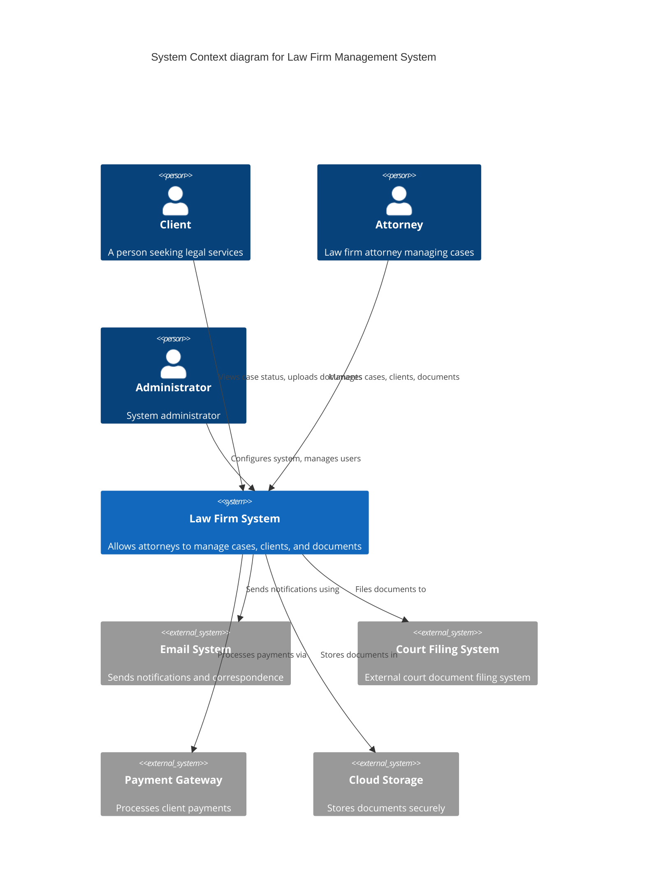

# System Context Diagram

This page demonstrates C4 model diagrams using Mermaid in Docusaurus.

## Law Firm Management System - Context

The following diagram shows the system context for our Law Firm Management System, illustrating how different users and external systems interact with it.

## Key Components

- **Clients**: Can view their case status and upload documents
- **Attorneys**: Manage cases, clients, and legal documents
- **Administrators**: Configure system settings and manage users
- **External Systems**: Integration with email, court filing, payments, and storage

## System Boundaries

The Law Firm Management System acts as the central hub, integrating with various external systems while providing different interfaces for different user types.
