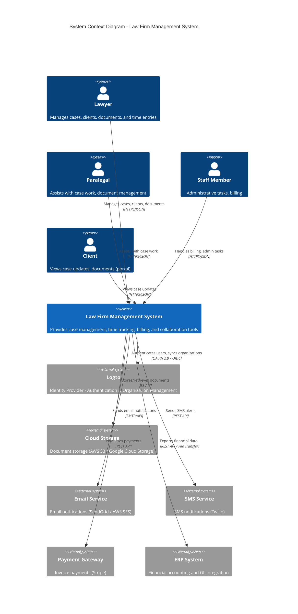
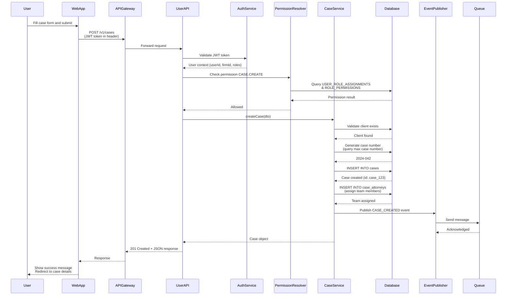
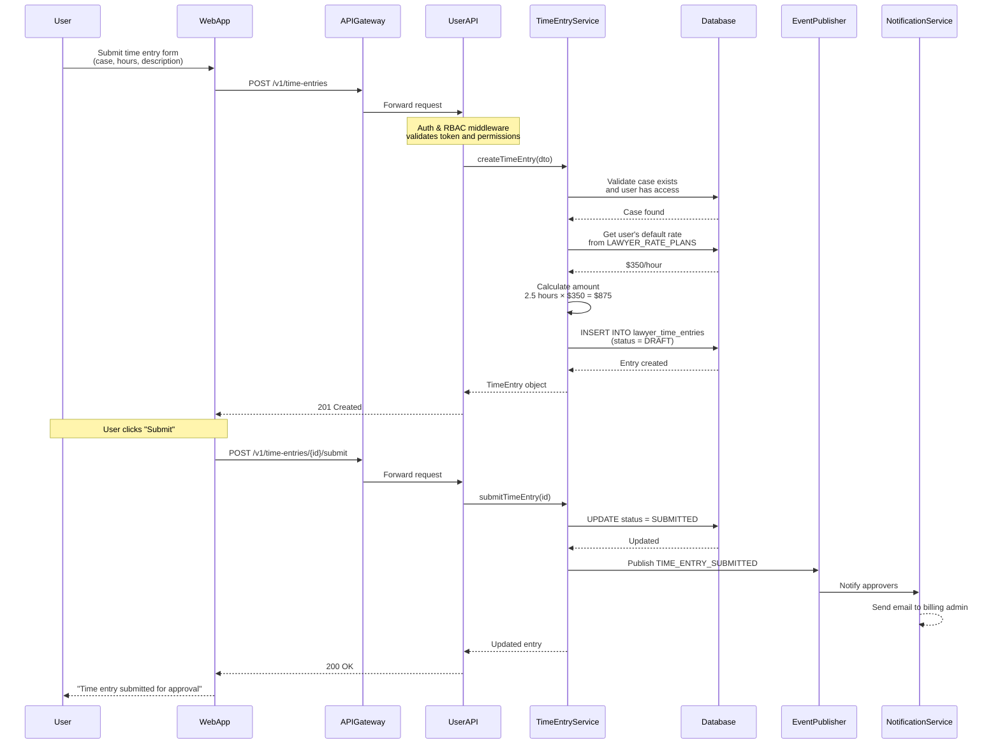
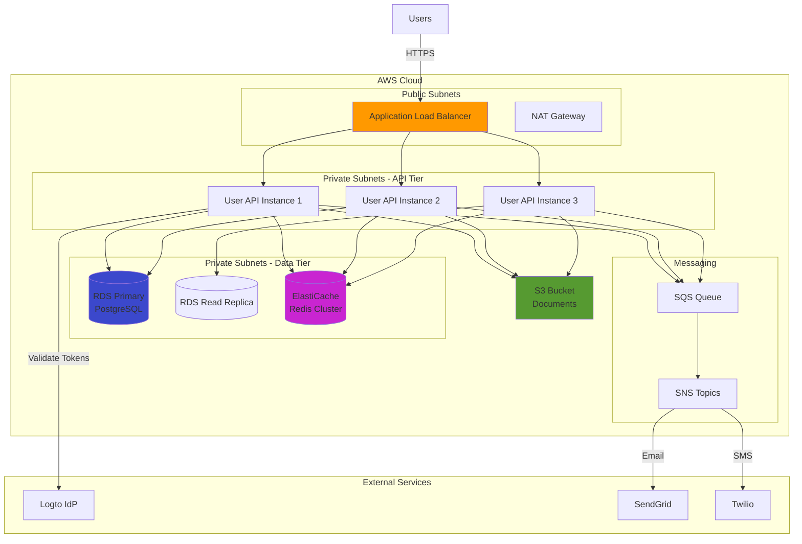
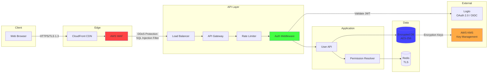
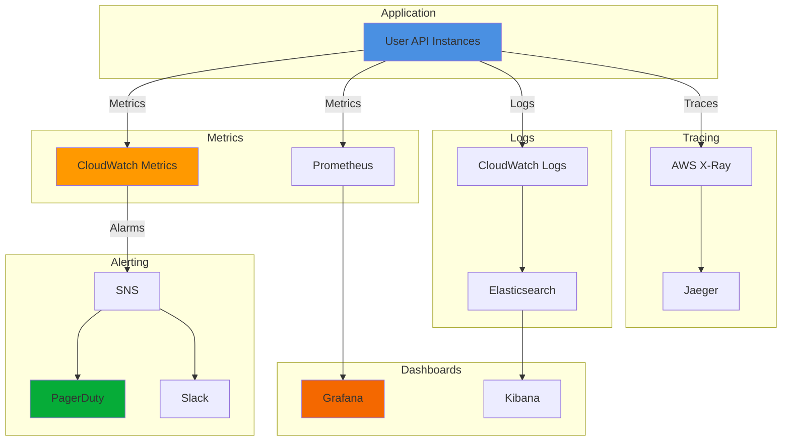

# C4 Model: Law Firm User API

This document presents the architecture of the Law Firm User Portal API using the C4 model (Context, Container, Component, Code).

## Table of Contents
1. [Level 1: System Context](#level-1-system-context)
2. [Level 2: Container Diagram](#level-2-container-diagram)
3. [Level 3: Component Diagram](#level-3-component-diagram)
4. [Level 4: Code Examples](#level-4-code-examples)

---

## Level 1: System Context

Shows the Law Firm Management System and how users and external systems interact with it.



### Context Description

**Users:**
- **Lawyers**: Create and manage cases, track time, review invoices
- **Paralegals**: Support case work, upload documents, manage appointments
- **Staff**: Handle administrative tasks, billing operations
- **Clients**: (Future) Portal access to view case status and documents

**External Systems:**
- **Logto**: Centralized identity management, SSO, organization memberships
- **Cloud Storage**: Secure document storage with versioning
- **Email/SMS Services**: Multi-channel notifications
- **Payment Gateway**: Client invoice payments
- **ERP System**: Financial data synchronization for accounting

---

## Level 2: Container Diagram

Shows the high-level technology components that make up the Law Firm Management System.

```mermaid
C4Container
    title Container Diagram - Law Firm Management System

    Person(user, "Law Firm User", "Lawyer, Paralegal, or Staff")

    System_Boundary(lawFirmSystem, "Law Firm Management System") {
        Container(webApp, "Web Application", "React + TypeScript", "Provides UI for case management, time tracking, and collaboration")
        Container(mobileApp, "Mobile App", "React Native", "Mobile access to cases, time entries, and appointments")
        Container(apiGateway, "API Gateway", "AWS API Gateway / Kong", "Routes requests, rate limiting, auth validation")
        Container(userApi, "User Portal API", "Node.js / NestJS", "Handles user-facing operations: cases, clients, documents, time entries")
        Container(adminApi, "Admin API", "Node.js / NestJS", "Admin operations: firm provisioning, user management, system config")
        Container(authService, "Auth Service", "Node.js", "Token validation, session management, permission checks")
        Container(notificationService, "Notification Service", "Node.js", "Sends email, SMS, push notifications")
        Container(documentService, "Document Service", "Node.js", "Document upload, versioning, access control")
        Container(billingService, "Billing Service", "Node.js", "Invoice generation, payment processing")

        ContainerDb(database, "Primary Database", "PostgreSQL", "Stores users, cases, clients, time entries, invoices")
        ContainerDb(cache, "Cache", "Redis", "Session data, rate limits, temporary data")
        ContainerQueue(queue, "Message Queue", "AWS SQS / RabbitMQ", "Async job processing, event distribution")
        Container(searchEngine, "Search Engine", "Elasticsearch", "Full-text search for cases, documents, clients")
    }

    System_Ext(logto, "Logto", "Identity Provider")
    System_Ext(storage, "S3 / GCS", "Document Storage")
    System_Ext(email, "SendGrid", "Email Service")
    System_Ext(sms, "Twilio", "SMS Service")

    Rel(user, webApp, "Uses", "HTTPS")
    Rel(user, mobileApp, "Uses", "HTTPS")

    Rel(webApp, apiGateway, "Makes API calls", "HTTPS/JSON")
    Rel(mobileApp, apiGateway, "Makes API calls", "HTTPS/JSON")

    Rel(apiGateway, userApi, "Routes user requests", "HTTP/JSON")
    Rel(apiGateway, adminApi, "Routes admin requests", "HTTP/JSON")

    Rel(userApi, authService, "Validates tokens, checks permissions", "gRPC")
    Rel(userApi, database, "Reads/writes data", "PostgreSQL protocol")
    Rel(userApi, cache, "Caches data", "Redis protocol")
    Rel(userApi, documentService, "Manages documents", "HTTP/JSON")
    Rel(userApi, notificationService, "Triggers notifications", "Message Queue")
    Rel(userApi, billingService, "Accesses billing data", "HTTP/JSON")
    Rel(userApi, searchEngine, "Searches data", "HTTP/JSON")

    Rel(authService, logto, "Validates tokens", "OAuth 2.0")
    Rel(authService, cache, "Caches tokens", "Redis protocol")

    Rel(documentService, storage, "Stores/retrieves files", "S3 API")

    Rel(notificationService, email, "Sends emails", "SMTP/API")
    Rel(notificationService, sms, "Sends SMS", "REST API")
    Rel(notificationService, queue, "Consumes events", "AMQP")

    Rel(billingService, database, "Reads/writes billing data", "PostgreSQL")
    Rel(billingService, queue, "Publishes events", "AMQP")

    UpdateRelStyle(user, webApp, $offsetX="-50", $offsetY="0")
    UpdateRelStyle(apiGateway, userApi, $offsetX="0", $offsetY="-10")
```



### Container Descriptions

**Frontend Containers:**
- **Web Application**: React-based SPA with TypeScript, responsive UI, real-time updates via WebSockets
- **Mobile App**: React Native for iOS/Android, offline support for time entries and case notes

**Backend Containers:**
- **API Gateway**: Request routing, rate limiting, authentication validation, request logging
- **User Portal API**: Core business logic for user-facing operations (cases, clients, documents, time tracking)
- **Admin API**: Administrative operations (firm management, user provisioning, system configuration)
- **Auth Service**: Token validation, session management, permission resolution via Logto
- **Notification Service**: Multi-channel notifications (email, SMS, push), template management
- **Document Service**: Document upload/download, versioning, access control, virus scanning
- **Billing Service**: Invoice generation, payment processing, financial calculations

**Data Containers:**
- **Primary Database**: PostgreSQL with multi-tenant isolation, row-level security, read replicas
- **Cache**: Redis for session data, rate limits, frequently accessed data
- **Message Queue**: Asynchronous job processing, event-driven architecture
- **Search Engine**: Elasticsearch for full-text search across cases, documents, clients

---

## Level 3: Component Diagram

Shows the internal components of the User Portal API container.

```mermaid
C4Component
    title Component Diagram - User Portal API

    Container_Boundary(userApi, "User Portal API") {
        Component(authMiddleware, "Authentication Middleware", "Express Middleware", "Validates JWT tokens, extracts user context")
        Component(rbacMiddleware, "RBAC Middleware", "Express Middleware", "Checks permissions based on user roles")
        Component(validationMiddleware, "Validation Middleware", "Express Middleware", "Validates request schemas using Joi/Zod")

        Component(profileController, "Profile Controller", "NestJS Controller", "Handles /me endpoints (get/update profile)")
        Component(caseController, "Case Controller", "NestJS Controller", "Handles /cases endpoints (CRUD operations)")
        Component(clientController, "Client Controller", "NestJS Controller", "Handles /clients endpoints")
        Component(documentController, "Document Controller", "NestJS Controller", "Handles /documents endpoints")
        Component(appointmentController, "Appointment Controller", "NestJS Controller", "Handles /appointments endpoints")
        Component(timeEntryController, "Time Entry Controller", "NestJS Controller", "Handles /time-entries endpoints")
        Component(invoiceController, "Invoice Controller", "NestJS Controller", "Handles /invoices endpoints (read-only)")
        Component(notificationController, "Notification Controller", "NestJS Controller", "Handles /notifications endpoints")
        Component(commentController, "Comment Controller", "NestJS Controller", "Handles /comments endpoints")

        Component(profileService, "Profile Service", "Service", "Business logic for user profiles")
        Component(caseService, "Case Service", "Service", "Business logic for case management")
        Component(clientService, "Client Service", "Service", "Business logic for client management")
        Component(timeEntryService, "Time Entry Service", "Service", "Business logic for time tracking")
        Component(commentService, "Comment Service", "Service", "Business logic for collaboration")

        Component(caseRepository, "Case Repository", "TypeORM Repository", "Data access for CASES table")
        Component(clientRepository, "Client Repository", "TypeORM Repository", "Data access for CLIENTS table")
        Component(timeEntryRepository, "Time Entry Repository", "TypeORM Repository", "Data access for LAWYER_TIME_ENTRIES table")
        Component(commentRepository, "Comment Repository", "TypeORM Repository", "Data access for COMMENTS table")

        Component(permissionResolver, "Permission Resolver", "Service", "Resolves user permissions based on roles and grants")
        Component(eventPublisher, "Event Publisher", "Service", "Publishes domain events to message queue")
        Component(auditLogger, "Audit Logger", "Service", "Logs all mutations for compliance")
    }

    ContainerDb(database, "PostgreSQL Database", "Database")
    ContainerDb(cache, "Redis Cache", "Cache")
    ContainerQueue(queue, "Message Queue", "Queue")
    Container(authService, "Auth Service", "External Service")
    Container(documentService, "Document Service", "External Service")

    Rel(profileController, authMiddleware, "Validates token")
    Rel(profileController, rbacMiddleware, "Checks permissions")
    Rel(profileController, profileService, "Uses")

    Rel(caseController, authMiddleware, "Validates token")
    Rel(caseController, rbacMiddleware, "Checks permissions")
    Rel(caseController, validationMiddleware, "Validates request")
    Rel(caseController, caseService, "Uses")

    Rel(clientController, clientService, "Uses")
    Rel(documentController, documentService, "Delegates to")
    Rel(timeEntryController, timeEntryService, "Uses")
    Rel(commentController, commentService, "Uses")

    Rel(caseService, caseRepository, "Persists data")
    Rel(caseService, permissionResolver, "Checks access")
    Rel(caseService, eventPublisher, "Publishes events")
    Rel(caseService, auditLogger, "Logs changes")

    Rel(clientService, clientRepository, "Persists data")
    Rel(timeEntryService, timeEntryRepository, "Persists data")
    Rel(commentService, commentRepository, "Persists data")
    Rel(commentService, eventPublisher, "Publishes @mention events")

    Rel(caseRepository, database, "Queries")
    Rel(clientRepository, database, "Queries")
    Rel(timeEntryRepository, database, "Queries")
    Rel(commentRepository, database, "Queries")

    Rel(permissionResolver, authService, "Fetches user roles")
    Rel(permissionResolver, cache, "Caches permissions")

    Rel(eventPublisher, queue, "Publishes")
    Rel(auditLogger, database, "Writes audit logs")
```



### Component Descriptions

**Middleware Components:**
- **Authentication Middleware**: Validates JWT tokens from Logto, extracts user context (userId, firmId, roles)
- **RBAC Middleware**: Checks if user has required permissions for the endpoint
- **Validation Middleware**: Validates request body/query parameters against schemas

**Controller Components:**
- **Profile Controller**: User profile management (/me)
- **Case Controller**: Case CRUD operations, team management
- **Client Controller**: Client CRUD operations
- **Document Controller**: Document metadata management (delegates storage to Document Service)
- **Appointment Controller**: Appointment scheduling and RSVP
- **Time Entry Controller**: Time tracking and submission
- **Invoice Controller**: Read-only invoice access
- **Notification Controller**: Notification management
- **Comment Controller**: Collaboration and commenting

**Service Components:**
- **Profile Service**: User profile business logic, preference management
- **Case Service**: Case lifecycle management, team assignments, status transitions
- **Client Service**: Client management, contact information
- **Time Entry Service**: Time entry calculation, status workflow (DRAFT → SUBMITTED → APPROVED)
- **Comment Service**: Comment creation, @mentions, threading

**Repository Components:**
- **Case Repository**: CASES table data access, complex queries with JOINs
- **Client Repository**: CLIENTS table data access
- **Time Entry Repository**: LAWYER_TIME_ENTRIES table data access
- **Comment Repository**: COMMENTS table data access, polymorphic resource queries

**Infrastructure Components:**
- **Permission Resolver**: Resolves user permissions from ROLES, PERMISSIONS, USER_ROLE_ASSIGNMENTS, RESOURCE_ACCESS_GRANTS
- **Event Publisher**: Publishes domain events (CaseCreated, DocumentShared, CommentAdded) to message queue
- **Audit Logger**: Immutable audit trail for compliance (who, what, when, where)

---

## Level 4: Code Examples

Shows implementation details for key components.

### 4.1 Case Service - Create Case Flow

```typescript
// src/services/case.service.ts

import { Injectable, ForbiddenException, BadRequestException } from '@nestjs/common';
import { InjectRepository } from '@nestjs/typeorm';
import { Repository } from 'typeorm';
import { Case } from '../entities/case.entity';
import { CreateCaseDto } from '../dto/create-case.dto';
import { PermissionResolver } from '../auth/permission-resolver.service';
import { EventPublisher } from '../events/event-publisher.service';
import { AuditLogger } from '../audit/audit-logger.service';

@Injectable()
export class CaseService {
  constructor(
    @InjectRepository(Case)
    private caseRepository: Repository<Case>,
    private permissionResolver: PermissionResolver,
    private eventPublisher: EventPublisher,
    private auditLogger: AuditLogger,
  ) {}

  async createCase(userId: string, firmId: string, dto: CreateCaseDto): Promise<Case> {
    // 1. Check permissions
    const canCreate = await this.permissionResolver.checkPermission(
      userId,
      firmId,
      'CASE.CREATE',
    );
    if (!canCreate) {
      throw new ForbiddenException('You do not have permission to create cases');
    }

    // 2. Validate business rules
    const clientExists = await this.validateClient(dto.clientId, firmId);
    if (!clientExists) {
      throw new BadRequestException('Client not found');
    }

    // 3. Generate case number
    const caseNumber = await this.generateCaseNumber(firmId);

    // 4. Create case entity
    const caseEntity = this.caseRepository.create({
      ...dto,
      caseNumber,
      lawFirmId: firmId,
      leadAttorneyId: dto.leadAttorneyId || userId, // Default to current user
      createdBy: userId,
      status: dto.status || 'INTAKE',
      priority: dto.priority || 'MEDIUM',
    });

    // 5. Save to database
    const savedCase = await this.caseRepository.save(caseEntity);

    // 6. Create case team assignments
    if (dto.assignedMembers?.length > 0) {
      await this.assignTeamMembers(savedCase.id, dto.assignedMembers);
    }

    // 7. Publish domain event
    await this.eventPublisher.publish({
      type: 'CASE_CREATED',
      aggregateId: savedCase.id,
      aggregateType: 'CASE',
      payload: {
        caseId: savedCase.id,
        caseNumber: savedCase.caseNumber,
        title: savedCase.title,
        clientId: savedCase.clientId,
        leadAttorneyId: savedCase.leadAttorneyId,
      },
      userId,
      firmId,
      timestamp: new Date(),
    });

    // 8. Audit log
    await this.auditLogger.log({
      action: 'CASE_CREATE',
      resourceType: 'CASE',
      resourceId: savedCase.id,
      userId,
      firmId,
      changes: { new: savedCase },
      timestamp: new Date(),
    });

    return savedCase;
  }

  private async validateClient(clientId: string, firmId: string): Promise<boolean> {
    // Check if client exists and belongs to the firm
    const count = await this.caseRepository
      .createQueryBuilder()
      .select('1')
      .from('clients', 'c')
      .where('c.id = :clientId', { clientId })
      .andWhere('c.law_firm_id = :firmId', { firmId })
      .getCount();

    return count > 0;
  }

  private async generateCaseNumber(firmId: string): Promise<string> {
    // Generate sequential case number: YYYY-NNN
    const year = new Date().getFullYear();
    const count = await this.caseRepository
      .createQueryBuilder('c')
      .where('c.law_firm_id = :firmId', { firmId })
      .andWhere('EXTRACT(YEAR FROM c.created_at) = :year', { year })
      .getCount();

    const nextNumber = (count + 1).toString().padStart(3, '0');
    return `${year}-${nextNumber}`;
  }

  private async assignTeamMembers(
    caseId: string,
    members: Array<{ userId: string; role: string }>,
  ): Promise<void> {
    // Insert into CASE_ATTORNEYS junction table
    const values = members.map(m => ({
      case_id: caseId,
      firm_user_profile_id: m.userId,
      assignment_role: m.role,
      starts_at: new Date(),
    }));

    await this.caseRepository.query(
      `INSERT INTO case_attorneys (case_id, firm_user_profile_id, assignment_role, starts_at)
       VALUES ${values.map(() => '(?, ?, ?, ?)').join(', ')}`,
      values.flatMap(v => Object.values(v)),
    );
  }
}
```

### 4.2 Permission Resolver - Check Access

```typescript
// src/auth/permission-resolver.service.ts

import { Injectable } from '@nestjs/common';
import { InjectRepository } from '@nestjs/typeorm';
import { Repository } from 'typeorm';
import { RedisService } from '../cache/redis.service';

interface PermissionCheck {
  userId: string;
  firmId: string;
  permission: string;
  resourceType?: string;
  resourceId?: string;
}

@Injectable()
export class PermissionResolver {
  constructor(
    @InjectRepository(UserRoleAssignment)
    private roleAssignmentRepo: Repository<UserRoleAssignment>,
    @InjectRepository(ResourceAccessGrant)
    private accessGrantRepo: Repository<ResourceAccessGrant>,
    private redis: RedisService,
  ) {}

  async checkPermission(
    userId: string,
    firmId: string,
    permission: string,
    resourceType?: string,
    resourceId?: string,
  ): Promise<boolean> {
    // 1. Check cache
    const cacheKey = `perm:${userId}:${firmId}:${permission}:${resourceType}:${resourceId}`;
    const cached = await this.redis.get(cacheKey);
    if (cached !== null) {
      return cached === 'true';
    }

    // 2. Resolve user's roles in this firm
    const roles = await this.getUserRoles(userId, firmId);

    // 3. Check if any role grants this permission
    const hasPermission = await this.roleHasPermission(roles, permission);

    if (!hasPermission) {
      await this.redis.setex(cacheKey, 300, 'false'); // Cache for 5 minutes
      return false;
    }

    // 4. If checking resource-level access, verify resource grant
    if (resourceType && resourceId) {
      const hasResourceAccess = await this.checkResourceAccess(
        userId,
        firmId,
        resourceType,
        resourceId,
      );

      await this.redis.setex(cacheKey, 300, hasResourceAccess ? 'true' : 'false');
      return hasResourceAccess;
    }

    await this.redis.setex(cacheKey, 300, 'true');
    return true;
  }

  private async getUserRoles(userId: string, firmId: string): Promise<string[]> {
    const assignments = await this.roleAssignmentRepo.find({
      where: {
        authUserId: userId,
        lawFirmId: firmId,
        // Only active assignments (ends_at is null or in future)
      },
      relations: ['role'],
    });

    return assignments.map(a => a.role.code);
  }

  private async roleHasPermission(roles: string[], permission: string): Promise<boolean> {
    // Query ROLE_PERMISSIONS table
    const count = await this.roleAssignmentRepo
      .createQueryBuilder()
      .select('1')
      .from('role_permissions', 'rp')
      .innerJoin('roles', 'r', 'r.id = rp.role_id')
      .innerJoin('permissions', 'p', 'p.id = rp.permission_id')
      .where('r.code IN (:...roles)', { roles })
      .andWhere('p.code = :permission', { permission })
      .getCount();

    return count > 0;
  }

  private async checkResourceAccess(
    userId: string,
    firmId: string,
    resourceType: string,
    resourceId: string,
  ): Promise<boolean> {
    // Check RESOURCE_ACCESS_GRANTS table
    const grant = await this.accessGrantRepo.findOne({
      where: {
        authUserId: userId,
        lawFirmId: firmId,
        resourceType,
        resourceId,
        // Check temporal validity (starts_at <= now, ends_at >= now or null)
      },
    });

    return !!grant;
  }
}
```

### 4.3 RBAC Middleware - Route Protection

```typescript
// src/middleware/rbac.middleware.ts

import { Injectable, NestMiddleware, ForbiddenException } from '@nestjs/common';
import { Request, Response, NextFunction } from 'express';
import { PermissionResolver } from '../auth/permission-resolver.service';

// Extend Express Request to include user context from auth middleware
interface AuthenticatedRequest extends Request {
  user: {
    id: string;
    firmId: string;
    roles: string[];
  };
}

@Injectable()
export class RBACMiddleware implements NestMiddleware {
  constructor(private permissionResolver: PermissionResolver) {}

  use(req: AuthenticatedRequest, res: Response, next: NextFunction) {
    // Extract required permission from route metadata
    const permission = this.extractPermission(req);

    if (!permission) {
      // No permission requirement, allow
      return next();
    }

    // Check if user has permission
    const hasPermission = await this.permissionResolver.checkPermission(
      req.user.id,
      req.user.firmId,
      permission,
    );

    if (!hasPermission) {
      throw new ForbiddenException(
        `You do not have permission: ${permission}`,
      );
    }

    next();
  }

  private extractPermission(req: AuthenticatedRequest): string | null {
    // Map route + method to permission
    const routePermissionMap: Record<string, string> = {
      'POST /cases': 'CASE.CREATE',
      'GET /cases/:id': 'CASE.READ',
      'PATCH /cases/:id': 'CASE.UPDATE',
      'DELETE /cases/:id': 'CASE.DELETE',
      'POST /clients': 'CLIENT.CREATE',
      'GET /clients/:id': 'CLIENT.READ',
      'PATCH /clients/:id': 'CLIENT.UPDATE',
      'POST /time-entries': 'TIME_ENTRY.CREATE',
      'PATCH /time-entries/:id': 'TIME_ENTRY.UPDATE',
      'POST /time-entries/:id/submit': 'TIME_ENTRY.SUBMIT',
      // ... more mappings
    };

    const key = `${req.method} ${req.route.path}`;
    return routePermissionMap[key] || null;
  }
}
```

### 4.4 Event Publisher - Domain Events

```typescript
// src/events/event-publisher.service.ts

import { Injectable } from '@nestjs/common';
import { SQS } from 'aws-sdk';

interface DomainEvent {
  type: string;
  aggregateId: string;
  aggregateType: string;
  payload: any;
  userId: string;
  firmId: string;
  timestamp: Date;
}

@Injectable()
export class EventPublisher {
  private sqs: SQS;
  private queueUrl: string;

  constructor() {
    this.sqs = new SQS({ region: process.env.AWS_REGION });
    this.queueUrl = process.env.SQS_QUEUE_URL!;
  }

  async publish(event: DomainEvent): Promise<void> {
    try {
      await this.sqs.sendMessage({
        QueueUrl: this.queueUrl,
        MessageBody: JSON.stringify(event),
        MessageAttributes: {
          eventType: {
            DataType: 'String',
            StringValue: event.type,
          },
          firmId: {
            DataType: 'String',
            StringValue: event.firmId,
          },
        },
      }).promise();

      console.log(`Published event: ${event.type} for ${event.aggregateType}:${event.aggregateId}`);
    } catch (error) {
      console.error('Failed to publish event:', error);
      // Consider dead-letter queue or retry logic
    }
  }
}
```

---

## Data Flow Diagrams

### User Creates a Case



### User Submits Time Entry



---

## Deployment Architecture



---

## Security Architecture



---

## Monitoring & Observability



---

## Summary

This C4 model provides a comprehensive view of the Law Firm User API architecture across multiple levels:

1. **System Context**: Shows how users and external systems interact with the platform
2. **Container Diagram**: Illustrates the high-level technology components (APIs, databases, queues)
3. **Component Diagram**: Details the internal structure of the User API (controllers, services, repositories)
4. **Code Examples**: Provides implementation details for critical flows

The architecture follows modern best practices:
- **Microservices**: Separate services for user API, admin API, notifications, documents
- **Event-Driven**: Asynchronous processing via message queues
- **Multi-Tenant**: Firm-level isolation with row-level security
- **Scalable**: Horizontal scaling of API instances, read replicas for database
- **Secure**: JWT authentication, RBAC, encryption at rest and in transit
- **Observable**: Comprehensive logging, metrics, and tracing

This design ensures the system can handle the complex requirements of a law firm management platform while maintaining security, compliance, and performance.
