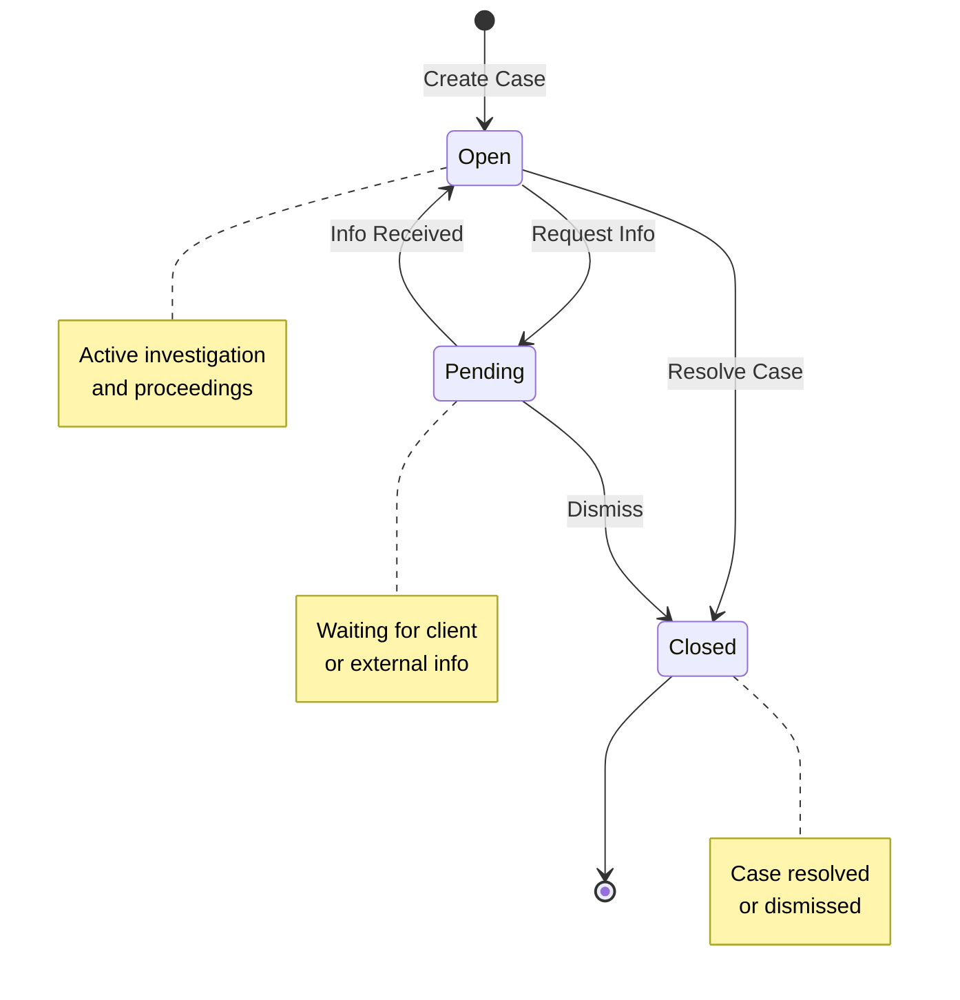
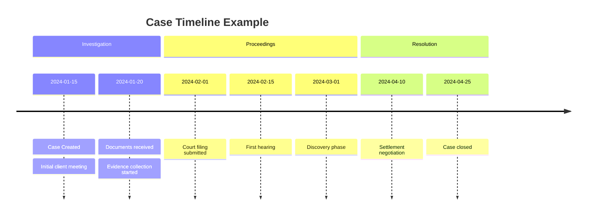
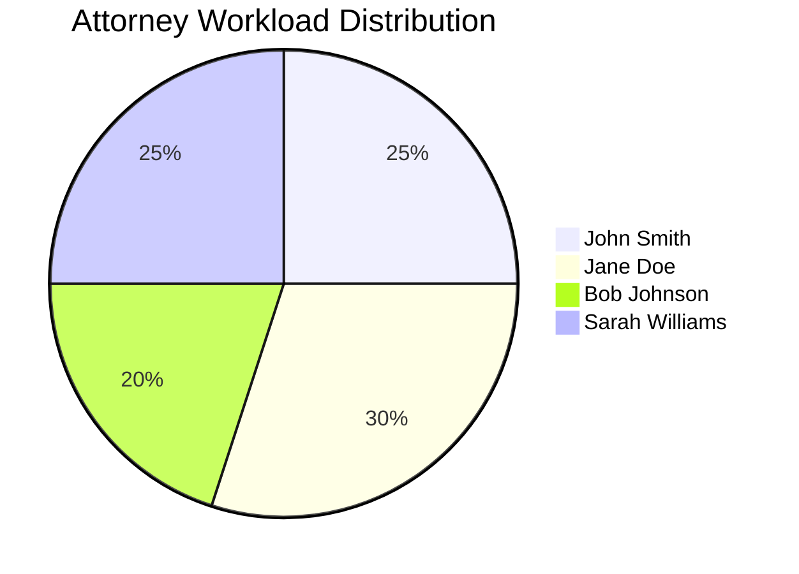
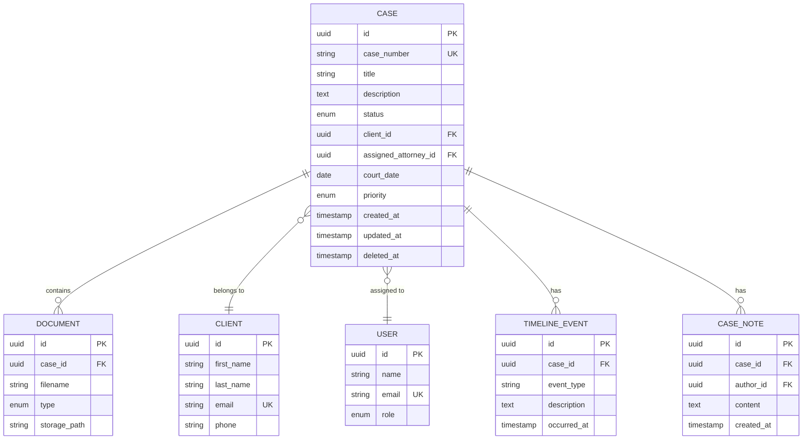

# Case Management Specification

This document specifies the requirements and behavior for the Case Management module.

## Overview

The Case Management module allows attorneys to create, track, and manage legal cases through their entire lifecycle.

## Functional Requirements

### FR-1: Case Creation
**Priority**: High
**Status**: ✅ Implemented

Attorneys must be able to create a new case with the following required information:
- Case title
- Client assignment
- Assigned attorney
- Initial description

**Optional fields**:
- Court date
- Priority level (low, medium, high, urgent)
- Case type
- Additional notes

**Validation Rules**:
- Title must be between 10 and 200 characters
- Client must exist in the system
- Attorney must be a valid user with attorney role
- Court date must be in the future

### FR-2: Case Status Management
**Priority**: High
**Status**: ✅ Implemented

Cases must support the following status workflow:



**Status Transitions**:
- **Open → Pending**: When waiting for information from client or court
- **Pending → Open**: When required information is received
- **Open → Closed**: When case is resolved successfully
- **Pending → Closed**: When case is dismissed
- **Closed**: Final state, no further transitions allowed

**Business Rules**:
- Only assigned attorney or admin can change case status
- Status changes must be logged with timestamp and user
- Email notification sent to client on status change

### FR-3: Case Search and Filtering
**Priority**: Medium
**Status**: ✅ Implemented

Users must be able to search and filter cases by:
- **Status**: Open, Pending, Closed
- **Client**: Filter by client ID or name
- **Attorney**: Filter by assigned attorney
- **Date Range**: Created date, court date
- **Priority**: Low, Medium, High, Urgent
- **Text Search**: Search in title and description

**Performance Requirements**:
- Search results must return within 2 seconds
- Support pagination (20 items per page)
- Results sorted by most recent first by default

### FR-4: Case Timeline
**Priority**: Medium
**Status**: 🔄 In Progress

Each case must maintain a chronological timeline of events:



**Timeline Events**:
- Case creation and status changes (automatic)
- Document uploads (automatic)
- Court dates and hearings (manual entry)
- Client communications (manual entry)
- Notes and comments (manual entry)

### FR-5: Case Assignment
**Priority**: Medium
**Status**: ✅ Implemented

**Assignment Rules**:
- Each case must have exactly one primary attorney
- Cases can have multiple supporting attorneys
- Only attorneys can be assigned to cases
- Assignment changes must be logged
- Client notified of attorney changes

**Workload Management**:


## Non-Functional Requirements

### NFR-1: Performance
- API response time < 500ms for 95th percentile
- Support 100 concurrent users
- Database queries optimized with proper indexes

### NFR-2: Security
- All case data encrypted at rest
- Role-based access control (RBAC)
- Audit logging for all case modifications
- Client data access restricted by attorney assignment

### NFR-3: Data Retention
- Active cases: Retained indefinitely
- Closed cases: Retained for 7 years
- Soft delete for case removal
- Archival process for cases older than 5 years

### NFR-4: Availability
- System uptime: 99.9% (excluding planned maintenance)
- Automated backups every 6 hours
- Disaster recovery plan with 4-hour RTO

## Data Model

### Case Entity



## API Endpoints

For detailed API documentation, see the [Admin API Documentation](/docs/admin-api/law-firm-admin-provisioning-api-logto-managed-rbac).

## Test Scenarios

### Test Case 1: Create Valid Case
```
Given: An attorney is authenticated
When: POST /cases with valid data
Then:
  - Status code 201
  - Case is created with generated ID
  - Case number is auto-generated
  - Created timestamp is set
  - Status is "open"
```

### Test Case 2: Invalid Status Transition
```
Given: A case with status "closed"
When: PUT /cases/{id} to change status to "open"
Then:
  - Status code 400
  - Error message: "Cannot reopen closed case"
  - Case status remains "closed"
```

### Test Case 3: Unauthorized Access
```
Given: A user is authenticated as a client
When: GET /cases (all cases)
Then:
  - Status code 403
  - Error message: "Insufficient permissions"
```

## Change Log

| Version | Date | Changes | Author |
|---------|------|---------|--------|
| 1.0 | 2024-01-15 | Initial specification | Product Team |
| 1.1 | 2024-02-01 | Added timeline requirements | Product Team |
| 1.2 | 2024-03-10 | Updated status workflow | Engineering Team |

## References

- [Architecture Documentation](/docs/c4-models/system-context)
- [Admin API Documentation](/docs/admin-api/law-firm-admin-provisioning-api-logto-managed-rbac)
