# Feature Specifications

This section contains detailed feature specifications for the Law Firm Admin Provisioning API system. Each specification follows a structured format with user scenarios, functional requirements, and success criteria.

## 📋 Active Specifications

### Admin Provisioning System

#### 1. [Complete Admin Provisioning API System](/docs/specs/complete-admin-provisioning/spec)

**Status**: ✅ Ready for Planning | **Requirements**: 81 | **Priority**: P1

Complete administrative system for managing law firms, users, RBAC via Logto organizations, resource access grants, and support access sessions.

**Key Features**:
- Law firm tenant creation and management
- Generic user provisioning with roles and credentials
- Logto organization integration
- Fine-grained resource access control
- Support access (act-as) functionality
- User capabilities and permissions

**Documents**:
- [Specification](/docs/specs/complete-admin-provisioning/spec)
- [Requirements Checklist](/docs/specs/complete-admin-provisioning/checklists/requirements)

---

#### 2. [Law Firm Tenant Management](/docs/specs/law-firm-tenant/spec)

**Status**: ✅ Ready for Planning | **Requirements**: 54 | **Priority**: P1

Focused specification for creating and managing law firm tenants with automatic Logto organization provisioning and synchronization.

**Key Features**:
- Law firm creation with unique slugs
- Automatic Logto organization creation
- Binding to existing Logto organizations
- Duplicate prevention
- Manual synchronization triggers

**Documents**:
- [Specification](/docs/specs/law-firm-tenant/spec)
- [Requirements Checklist](/docs/specs/law-firm-tenant/checklists/requirements)

---

#### 3. [Generic User Provisioning System](/docs/specs/generic-user-provisioning/spec)

**Status**: ✅ Ready for Planning | **Requirements**: 82 | **Priority**: P1

Role and credential-driven user provisioning system with identity management, firm profiles, functional roles, and professional credentials.

**Key Features**:
- Create or link Logto user accounts
- Firm-specific user profiles
- Multiple functional roles (LAWYER, PARALEGAL, ADMIN, etc.)
- Professional credentials (bar licenses, notary, etc.)
- Organization role assignment
- User filtering and search

**Documents**:
- [Specification](/docs/specs/generic-user-provisioning/spec)
- [Requirements Checklist](/docs/specs/generic-user-provisioning/checklists/requirements)

---

#### 4. [Support Access (Act-As) Feature](/docs/specs/support-access-act/spec)

**Status**: ✅ Ready for Planning | **Requirements**: 65 | **Priority**: P2

Temporary user impersonation system for support staff with delegated tokens, full audit logging, and automatic expiration.

**Key Features**:
- Time-limited support sessions (5-120 minutes)
- Delegated JWT tokens with actor metadata
- Automatic token expiration
- Manual session revocation
- Complete audit trail
- Optional scope narrowing

**Documents**:
- [Specification](/docs/specs/support-access-act/spec)
- [Requirements Checklist](/docs/specs/support-access-act/checklists/requirements)

---

#### 5. [Resource Access Management](/docs/specs/resource-access-management/spec)

**Status**: ✅ Ready for Planning | **Requirements**: 94 | **Priority**: P2

Fine-grained access control system with resource grants, access levels (VIEW, EDIT, UPLOAD, ADMIN), field-level policies, and user capabilities aggregation.

**Key Features**:
- Resource type and subtype registry
- Hierarchical resource/subresource structure
- Multiple access levels (VIEW, EDIT, UPLOAD, ADMIN)
- Grant source tracking (MANUAL, ROLE, CASE_MEMBER, SYSTEM)
- Time-bounded grants with startsAt/endsAt
- Field-level permission policies (ALL, ONLY, EXCEPT modes)
- Effective resource policies per user
- User capabilities aggregation (scopes + policies + case IDs)

**Documents**:
- [Specification](/docs/specs/resource-access-management/spec)

---

#### 6. [Professional Credentials Management](/docs/specs/professional-credentials/spec)

**Status**: ✅ Ready for Planning | **Requirements**: 73 | **Priority**: P2

Professional credential management system for tracking bar licenses, notary certifications, and other professional credentials with jurisdiction support and status tracking.

**Key Features**:
- Add, list, and remove professional credentials
- Multiple credential types (BAR_LICENSE, NOTARY, OTHER)
- Jurisdiction tracking (state/country codes)
- Credential status management (ACTIVE, SUSPENDED, EXPIRED)
- Multi-credential support per user
- Credential-based user filtering
- Integration with user provisioning

**Documents**:
- [Specification](/docs/specs/professional-credentials/spec)

---

## 🔄 Specification Workflow

Each specification goes through these phases:

```mermaid
graph LR
    A[📝 Draft] --> B[✅ Ready for Planning]
    B --> C[🔄 In Planning]
    C --> D[📋 Tasks Created]
    D --> E[⚙️ Implementation]
    E --> F[✔️ Completed]

    style A fill:#fff3cd
    style B fill:#d1ecf1
    style C fill:#cce5ff
    style D fill:#d4edda
    style E fill:#ffeeba
    style F fill:#c3e6cb
```

### Status Legend

| Status | Description |
|--------|-------------|
| 📋 **Pending** | Specification not yet started |
| 🔄 **In Progress** | Specification being written |
| ✅ **Ready for Planning** | Specification complete, awaiting technical planning |
| 🔄 **In Planning** | Technical plan being created |
| 📋 **Tasks Created** | Implementation tasks defined |
| ⚙️ **Implementation** | Development in progress |
| ✔️ **Completed** | Feature implemented and deployed |

---

## 🎯 Next Steps

### For Completed Specifications

1. **Review** - Read through the specification and requirements checklist
2. **Plan** - Run `/speckit.plan` to create technical implementation plan
3. **Tasks** - Run `/speckit.tasks` to generate actionable task breakdown
4. **Implement** - Run `/speckit.implement` to execute with AI assistance

### For New Features

1. **Describe** - Run `/speckit.specify [your feature description]`
2. **Clarify** - Run `/speckit.clarify` if requirements need refinement
3. **Validate** - Review the generated requirements checklist
4. **Continue** - Follow the workflow above

---

## 📊 Specification Metrics

| Metric | Value |
|--------|-------|
| Total Specifications | 6 |
| Completed Specs | 6 |
| Ready for Planning | 6 |
| Total Requirements | 449 |
| Total User Stories | 39 |

---

## 🔗 External References

- [SpecKit Documentation](https://github.com/github/spec-kit)
- [Logto Documentation](https://docs.logto.io/)
- [OpenAPI Specification](https://swagger.io/specification/)
